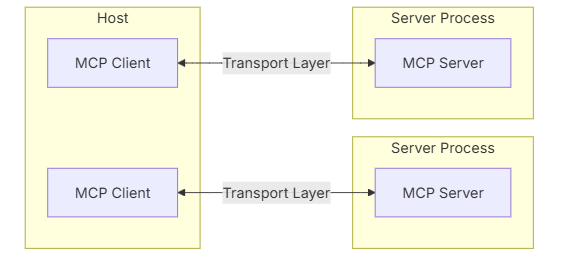
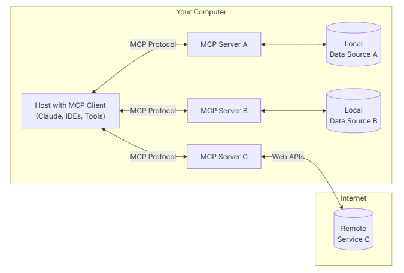
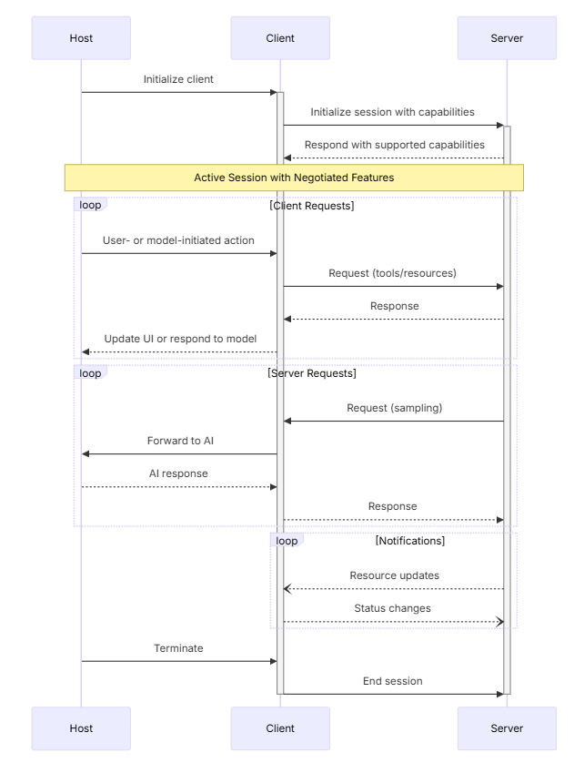

# Overview

The Model Context Protocol (MCP) follows a client-host-server architecture where each host can run multiple client instances. This architecture enables users to integrate AI capabilities across applications while maintaining clear security boundaries and isolating concerns. Built on JSON-RPC, MCP provides a stateful session protocol focused on context exchange and sampling coordination between clients and servers.

MCP follows a client-server architecture where:

- Hosts are LLM applications (like Claude Desktop or IDEs) that initiate connections
- Clients maintain 1:1 connections with servers, inside the host application
- Servers provide context, tools, and prompts to clients

The Model Context Protocol uses a capability-based negotiation system where clients and servers explicitly declare their supported features during initialization. Capabilities determine which protocol features and primitives are available during a session.

- Servers declare capabilities like resource subscriptions, tool support, and prompt templates
- Clients declare capabilities like sampling support and notification handling
- Both parties must respect declared capabilities throughout the session
- Additional capabilities can be negotiated through extensions to the protocol

